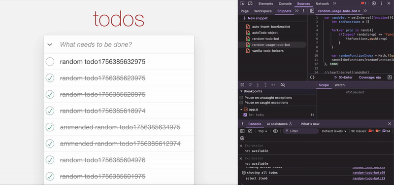

# 📝 TodoMVC Automation Bot (JavaScript)

This project is an automation experiment for the [TodoMVC ES6 App](https://todomvc.com/examples/javascript-es6/dist/)).  
It was created **to apply QA testing practices** by simulating user actions.  

---

## 🎥 Demo
  


---
## 🚀 Features
- Create todos automatically
- Toggle individual todos or all todos
- Amend existing todos
- Delete todos
- Clear completed todos
- Switch between "All", "Active", and "Completed" views
- Random bot to simulate unpredictable user activity

## 📂 Project Structure
- **auto-todo-object.js** – Main automation functions in a clean object
- **vanilla-todo-helpers-copy.js** – Helper functions (vanilla style)
- **random-todo-bot.js** – Bot logic for random automation
- **random-usage-todo-bot.js** – Interval-based random usage of bot functions

## 🛠️ How to Use
1. Open the [TodoMVC ES6 App](https://todomvc.com/examples/javascript-es6/dist/) in your browser.
2. Open **Developer Tools** → go to the **Sources** tab → **Snippets**.
3. Upload the following JavaScript files:
   - `auto-todo-object.js`
   - `random-todo-bot.js`
   - `random-usage-todo-bot.js`
4. Run the snippets sequentially (**Command + Enter** or **Ctrl + Enter**):
   1. `auto-todo-object.js`
   2. `random-todo-bot.js`
   3. `random-usage-todo-bot.js`
5. The bot will now start running and performing random actions on the TodoMVC app.
6. To stop the bot at any time, type in the console:
   ```js
   clearInterval(randoBot);
   ```
## 📝 Additional Notes
The following notes explain certain design decisions and helper functions.    
  
In random-todo-bot.js, the deleteRandomTodo function is commented out on purpose:

```js
// this.deleteRandomTodo = function(){
//     x = getRandomItemIndex();
//     if(x > 0){
//         console.log("delete todo " + x)
//         autoTodo.deleteTodo(x);
//     }
// }
```

This is to avoid the bot performing multiple consecutive delete actions, which could quickly remove all todos.
Keeping it disabled ensures you can actually see the results of other random actions (create, toggle, amend) while testing.
You can uncomment it if you want full randomness, but be aware that todos may disappear too fast.

## 📜 vanilla-todo-helpers-copy.js

This was the first version of the automation helpers, before creating the structured bot.  
Most of the helpers are self-explanatory, but here’s how to use them directly in the browser console:

### Available Helpers

- **`clickItem(item)`** – Clicks any DOM element you pass in.  
  ```js
  clickItem(document.querySelector("ul.todo-list li:nth-child(1) input.toggle"));
  // toggles the first todo

- **`toggleTodo(num)`** – Toggles the checkbox of the nth todo.
  ```js
  toggleTodo(2)
  // toggles the 2nd todo


- **`deleteTodo(num)`** – Deletes the nth todo.
  ```js
  deleteTodo(3)
  // deletes the 3rd todo


- **`clearCompleted()`** – Removes all todos that are marked as completed.
  ```js
  clearCompleted()
  // clears all completed todos

- **`showAll()`** – Switches the view to show all todos.
  ```js
  showAll()
  // shows all todos

- **`showActive()`** – Switches the view to show only active (incomplete) todos.
  ```js
  showActive()
  // shows all active todos if there are any

- **`showCompleted()`** – Switches the view to show only completed todos.
  ```js
  showCompleted()
  // shows all completed todos if there are any

- **`createTodo(name)`** – Creates a new todo with the given text.
  ```js
  createTodo("Buy groceries")
  // creates a new todo that reminds you to "Buy Groceries"

- **`amendTodo(position, name)`** – Edits the nth todo and replaces its text.
  ```js
  amendTodo(1, "Walk the dog")
  // edits the first todo item and updates the text with "Walk the dog"


